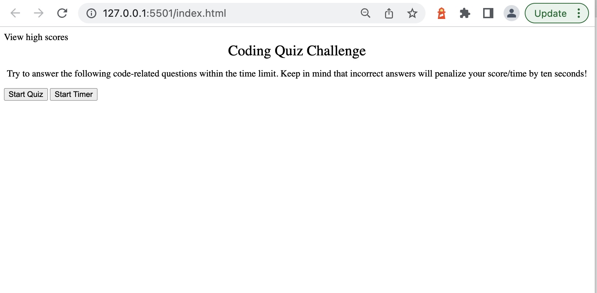
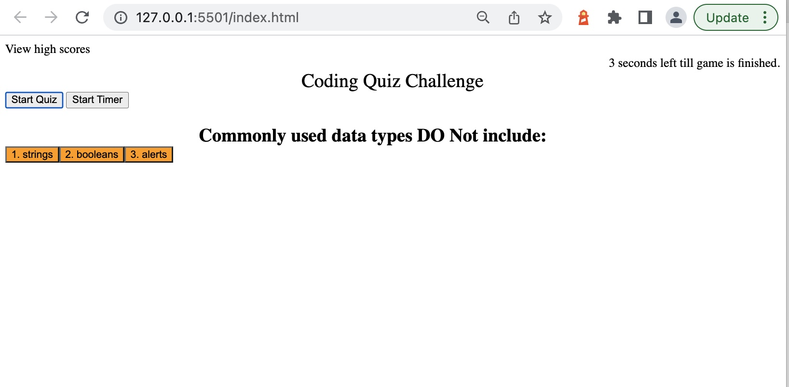
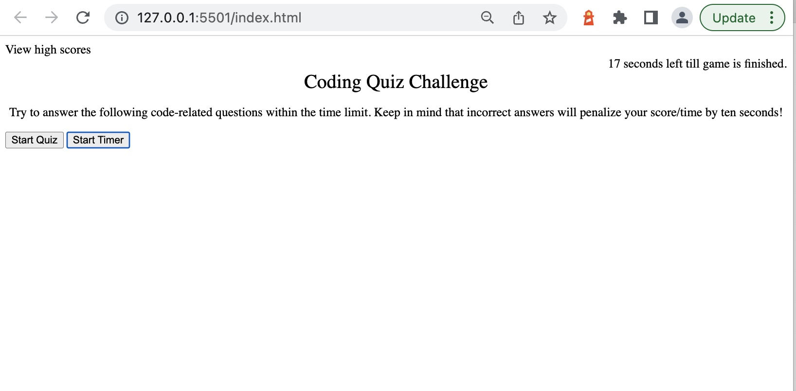

# Coding Quiz

Link to live site: [https://conniehhw.github.io/coding-quiz/](https://conniehhw.github.io/coding-quiz/)

## Description

A timed coding quiz with multiple choice questions.

## Installation

This app will run in the browser and features dynamically updated HTML & CSS powered by JavaScript Code.

## Preview & Usage

1. Navigate to the webpage.
2. Click on start timer button, then start quiz button.
3. Select an answer from the choices provided.
4. As each anwer is submitted, the browser will generate on screen whether the question was answered correctly or if it was wrong.
5. At the end of the quiz, it will tally up the score and there is an option to add your initials and join a list of scores from other players.

## License

There were no licenses obtained for this project. For more information on licenses, follow this link:
[https://choosealicense.com/](https://choosealicense.com/).
